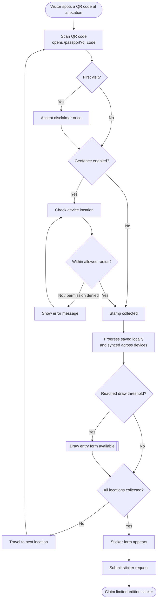

# Stamp Passport — User Journeys

Two simple flow diagrams describing the core journeys of the plugin.
Rendered with [Mermaid](https://mermaid.js.org/) (supported by GitHub and most IDE previews).

---

## 1. Visitor journey — from discovering a QR code to claiming a sticker

---

## 2. Parcours du gestionnaire — de la configuration au tirage d'un gagnant

```mermaid
flowchart TD
    A([Le gestionnaire se connecte au CP de Craft]) --> B

    %% ── Phase de configuration ──
    B[Installer / activer le module Stamp Passport] --> C[Paramètres généraux :<br/>nom du module, préfixe de route]
    C --> D[Géorepérage :<br/>activer, définir le rayon en mètres]
    D --> E[Prix :<br/>seuil du tirage, nombre max d'autocollants]
    E --> F[Intégration Freeform :<br/>formulaire de tirage et d'autocollant]
    F --> G[Apparence :<br/>logos, panneau de bois, couleurs, arrière-plans, favicon]
    G --> H[Analytique :<br/>identifiant de mesure GA4]
    H --> I[Textes d'affichage par site<br/>fr / en — multilingue]
    I --> J[Règles du concours par site :<br/>texte du lien, contenu, règlement complet]
    J --> K[Créer les emplacements :<br/>coordonnées, image, contenu par site, lien]
    K --> L[Générer et imprimer les codes QR]
    L --> M[Déployer les codes QR aux emplacements physiques]

    M --> N{{La campagne se déroule}}

    %% ── Phase de campagne et tirage ──
    N --> O[Ouvrir Stamp Passport → Statistiques]
    O --> P[Examiner le tableau de bord :<br/>visiteurs, validations, participants admissibles]
    P --> Q{Ajuster la plage de dates?}
    Q -- Oui --> R[Définir les dates de début / fin] --> P
    Q -- Non --> S[Noter le nombre d'admissibles<br/>participants ayant atteint le seuil]
    S --> T[Ouvrir les soumissions Freeform du tirage]
    T --> U[Vérifier l'admissibilité des soumissions]
    U --> V[Sélectionner aléatoirement un gagnant<br/>parmi les soumissions admissibles]
    V --> W([Contacter le gagnant et remettre le prix])

    %% ── Couleurs par phase ──
    classDef config fill:#eef3fb,stroke:#9bb4d6,color:#1e1a17;
    classDef campagne fill:#fef6e9,stroke:#d9b483,color:#1e1a17;
    class B,C,D,E,F,G,H,I,J,K,L,M config;
    class O,P,Q,R,S,T,U,V campagne;
```

